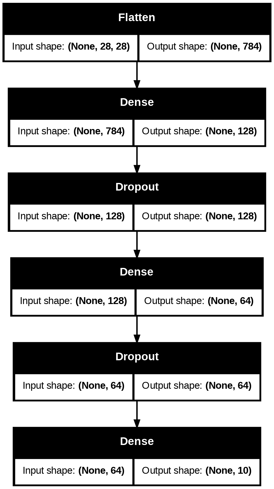

# Image Classification using Artificial Neural Network (ANN)

## Project Overview
This project implements an **Artificial Neural Network (ANN)** to perform image classification on the **Fashion-MNIST dataset**.  
The model classifies grayscale images of clothing items into 10 different categories.

The goal of this project is to understand the **end-to-end machine learning pipeline**, including data preprocessing, model building, training, and evaluation using multiple performance metrics.

---

##  Dataset
- **Dataset:** Fashion-MNIST  
- **Images:** 28×28 grayscale  
- **Classes:** 10 fashion categories  
- **Training samples:** 60,000  
- **Testing samples:** 10,000  

---

##  Class Labels
- T-shirt/top  
- Trouser  
- Pullover  
- Dress  
- Coat  
- Sandal  
- Shirt  
- Sneaker  
- Bag  
- Ankle boot  

---

##  Technologies & Tools Used
### Programming & Libraries

### Data Visualization

### Machine Learning & Deep Learning

### Tools

---

##  Machine Learning Pipeline
1. Data loading using Keras dataset API  
2. Data visualization and normalization  
3. ANN model creation using Keras Sequential API  
4. Model training with validation  
5. Performance evaluation using:
   - Accuracy  
   - Precision  
   - Recall  
   - F1-score  
   - Confusion Matrix  

---

##  Model Architecture
- Input layer: Flatten (28×28 → 784)  
- Hidden layer: Dense (128 neurons, ReLU activation)  
- Output layer: Dense (10 neurons, Softmax activation)  

The following diagram represents the architecture of the Artificial Neural Network (ANN) used in this project:

---

## Results
- **Test Accuracy:** ~88%  
- The model performs well on distinct classes such as **Trouser, Sandal, Bag, and Ankle Boot**  
- Lower performance observed on visually similar classes such as **Shirt, T-shirt, and Pullover**

---

##  Evaluation Metrics
A detailed classification report was generated using:
- Precision  
- Recall  
- F1-score  

This helps identify class-wise strengths and limitations of the ANN model.

---

##  Limitations
- ANN does not capture spatial features in images
- Similar apparel classes show confusion

---

##  Future Improvements
- Implement **Convolutional Neural Networks (CNN)**
- Apply data augmentation techniques
- Hyperparameter tuning

---

##  Conclusion
This project demonstrates a complete **image classification pipeline using ANN** and highlights the importance of evaluation metrics beyond accuracy.  
It serves as a strong **academic and learning project** in machine learning.

---

##  Author
**Aditya Dubey**

